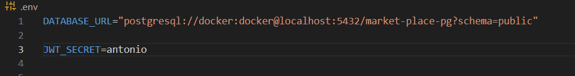
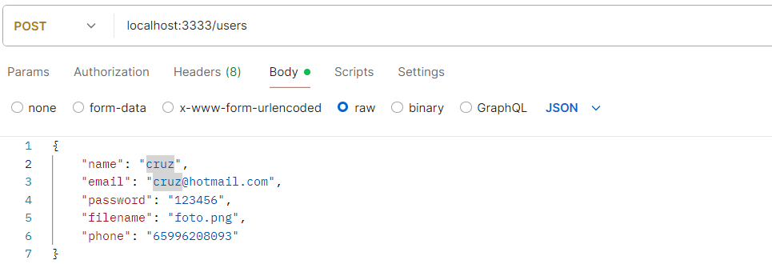
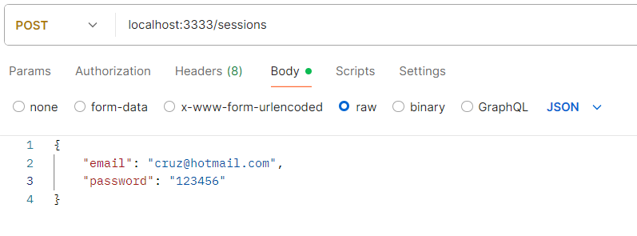
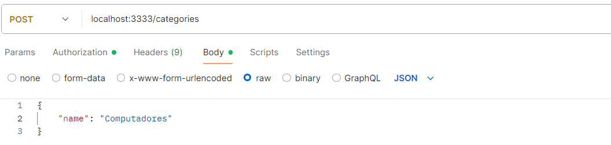
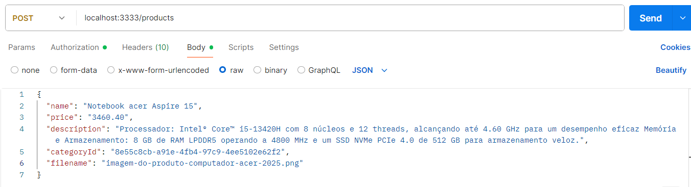
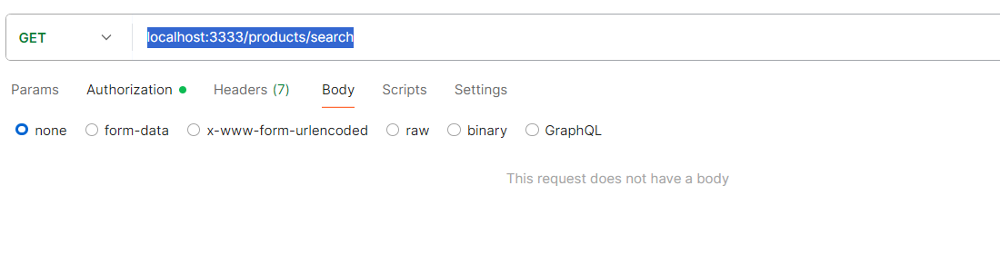
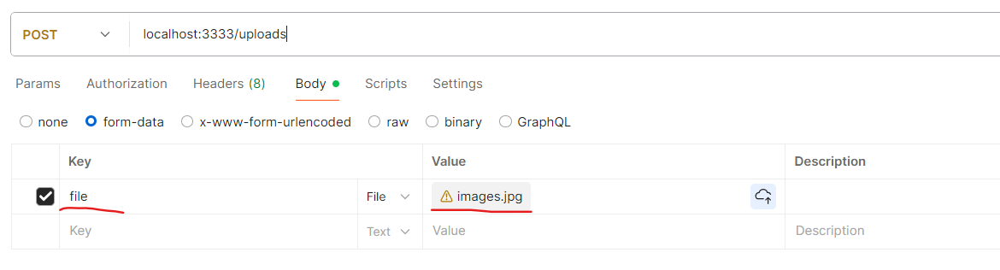

## 🛒 Marketplace - Painel do Vendedor

- Este projeto é uma API desenvolvida para gerenciar produtos e autenticação de vendedores em um painel administrativo de marketplace. Ele fornece funcionalidades como cadastro, login, listagem de produtos, upload de imagens e controle de acesso por token JWT.

## ✨ Tecnologias Utilizadas

- TypeScript	Linguagem utilizada no backend para tipagem estática e segurança em tempo de desenvolvimento.

- Node.js	Ambiente de execução para JavaScript no servidor.

- Express	Framework minimalista para criação de APIs REST.

- Prisma ORM	ORM moderno e eficiente para interação com banco de dados relacional.

- Docker	Containerização da aplicação para ambientes consistentes.

- Zod	Biblioteca de validação e parse de esquemas de dados.

- JWT (jsonwebtoken)	Geração e verificação de tokens de autenticação.

- Bcrypt	Criptografia de senhas com hashing seguro.

- Multer	Middleware para tratamento de upload de arquivos (como imagens de produtos).

- CORS	Middleware para habilitar requisições cross-origin entre o frontend e o backend.

- Jest	Testes unitários e de integração.

- Supertest	Testes de rotas HTTP com integração ao Jest.

- ts-node / tsx	Execução de arquivos .ts sem precisar compilar manualmente.

## 🔐 Funcionalidades

- Autenticação: Login seguro com JWT.

- Criptografia: Senhas armazenadas com hash (bcrypt).

- Validação: Todas as entradas são validadas com Zod.

- Produtos: CRUD de produtos, com upload de imagens usando Multer.

- Banco de Dados: Integração com PostgreSQL (ou outro relacional) via Prisma.

- Testes: Cobertura com Jest e Supertest.

## Startando o projeto

- Ao baixar ou clonar o repositorio 

1 - Configure as variaveis ambiente em um arquivo .env na raiz do projeto você pode usar o Docker para testar local

2 - Baixe as dependencias do projeto.

 npm install

3 - Executar o comando para criar as migration no banco de dados

 npx prisma migrate dev

## Rotas http para criação dos CRUDS

- Pode utilizar o Postman ou Insominia.

- Criação de usuário.

- Autenticação do usuário

- Criação de categorias

- Criação de produto

- Buscando por todos os produtos cadastrados

- Subindo upload de arquivo no projeto, para essa rota deve ser informado no body um campo file com nome file igual exemplo da imagem para realizar o upload.

